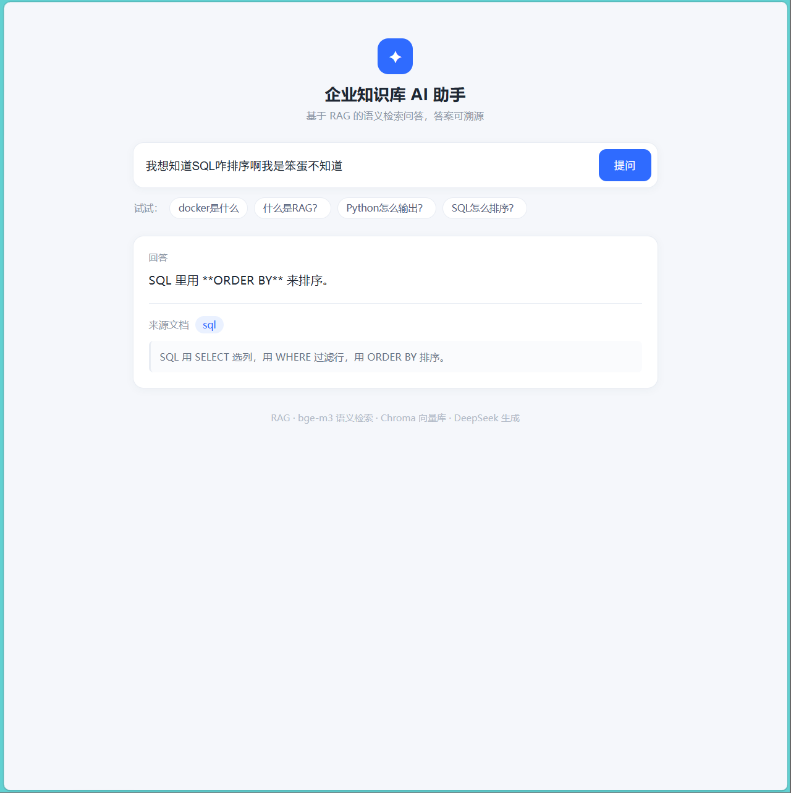

# 企业知识库 AI 助手（Enterprise Knowledge AI Assistant）

基于 **RAG（检索增强生成）** 的知识库问答服务：上传文档 → 切块 → 语义向量化 → 检索 → 大模型生成，返回答案并**标注来源**。提供网页界面和 REST API。

> 本项目是个人学习 / 求职作品，用于练习真实企业 RAG 的完整链路：**文档处理、向量化、检索、生成、溯源、API、前端页面、部署**。

---

## 1. 项目简介

一个可运行的知识库问答系统。用户上传 Markdown / 文本文件作为知识库，然后在网页输入问题，系统会：
1. 把问题转成语义向量；
2. 在知识库里检索**最相关的文档块**；
3. 让大模型**基于该文档块**回答；
4. 同时返回**来源文档**和**引用原文**，方便核对、防止编造。

## 2. 项目背景

企业里大量知识散落在文档中（规章制度、产品手册、FAQ），员工查找困难、新人不熟悉。传统方式要么靠人搜，要么靠 LLM 直接回答（但会**编造**）。RAG 通过在回答前**先检索真实文档**，让回答有依据、可溯源，是目前企业知识库的主流解法。

## 3. 核心功能

- 📄 **文档入库**：通过 `POST /upload` 上传 `.md` / `.txt` 文件，自动保存到 `knowledge/` 并**重建索引**
- 🔪 **文档切块**：按句号把长文档切成小块
- 🧬 **语义向量化**：用 embedding 模型（bge-m3）把文字变成语义向量
- 🔍 **语义检索**：问题和文档块用余弦相似度比对，找到最相关块
- 🧠 **生成回答**：把命中的块作为上下文交给 DeepSeek 生成
- 📌 **引用来源**：返回 `source_title` 和 `source_chunk`，答案可溯源
- 🛠️ **工具调用（Function Calling）**：`/agent` 接口把检索封装成**工具**，由**模型自己决定**是否调用（闲聊不调、问知识库话题才调），并返回调用轨迹 `trace`
- 🖥️ **网页前端**：输入问题、显示答案与来源

> 说明：当前每次请求都是**无状态**的（不保存对话历史）。多轮会话 / 上下文管理见 Future Work。

## 4. 技术栈

| 层 | 技术 |
|---|---|
| 后端 | Python · FastAPI · Uvicorn |
| 向量化 | 硅基流动 SiliconFlow · `BAAI/bge-m3`（OpenAI 兼容接口） |
| 生成 | DeepSeek · `deepseek-chat` |
| 向量检索 | **Chroma 向量库**（语义）+ **字符级 TF-IDF**（关键词）→ **混合检索**（融合打分 + top-K） |
| 数据处理 | python-dotenv · python-multipart |
| 前端 | HTML · CSS · 原生 JS（`fetch`） |

> 说明：**生成（DeepSeek）和向量化（硅基流动 bge-m3）是两个不同服务**。因为 DeepSeek 只开放了 `chat`（生成）接口，没有 `embeddings` 接口；embedding 我们用提供免费中文模型的硅基流动（OpenAI 兼容，`api.siliconflow.cn`）。

## 5. 系统架构

```
浏览器（前端页面 static/index.html）
         │  POST /ask  {"question": "..."}
         ▼
     FastAPI 服务（main.py）
         │
         ├─ 1. 切块 chunk（按句号切）
         ├─ 2. 语义向量化 embed_texts()  → 硅基流动 bge-m3
         ├─ 3. 检索 collection.query()   → Chroma 向量库返回最相近的块 + 来源
         ├─ 4. 生成 client.chat.completions → DeepSeek deepseek-chat
         └─ 5. 返回 {answer, source_title, source_chunk}

知识库：knowledge/ 文件夹（.md/.txt），POST /upload 上传新增并重建索引
向量库：chroma_db/（Chroma 持久化，重启不丢；POST /reindex 可全量重建）
```

## 6. 项目目录

```
enterprise-knowledge-ai-assistant/
├── main.py            # FastAPI 服务（切块/向量化/检索/生成/接口）
├── knowledge/         # 知识库（.md/.txt 文档），往里面加文件即新增知识
├── static/
│   └── index.html     # 前端页面
├── chroma_db/         # 向量库数据（Chroma 生成，已被 .gitignore 忽略）
├── requirements.txt   # Python 依赖
├── .env.example       # 配置示例（复制为 .env 填 key）
├── .gitignore         # 忽略 .env / .venv / chroma_db 等
└── README.md
```

## 7. 环境安装

```powershell
# 建议 Python 3.10+
python -m venv .venv
.\.venv\Scripts\python.exe -m pip install -r requirements.txt
```

## 8. 配置方法

1. 复制 `.env.example` 为 `.env`；
2. 填入两个 key：
   - `DEEPSEEK_API_KEY`：DeepSeek 平台的 key（生成回答）
   - `SILICONFLOW_API_KEY`：硅基流动的 key（向量化，免费）
3. `knowledge/` 里放你的文档（`.md` / `.txt`）。

## 9. 启动方式

**方式一：直接运行（最简单）**
```powershell
python main.py
```

**方式二：双击 `run.bat`**（Windows 用户）

**方式三：uvicorn 命令（等价）**
```powershell
python -m uvicorn main:app --reload
```
> `python -m uvicorn` = 用 Python 启动 uvicorn 服务器；`main:app` = 去 `main.py` 里找名为 `app` 的对象；`--reload` = 改代码自动重启。

启动后：
- 网页：http://127.0.0.1:8000
- 接口文档：http://127.0.0.1:8000/docs
- 停止服务：`Ctrl+C`

## 10. API 说明

| 接口 | 方法 | 说明 |
|---|---|---|
| `/` | GET | 前端页面 |
| `/ask` | POST | 知识库问答（流程写死：先检索再回答）。返回 `{question, answer, source_title, source_chunk, sources_used, score, semantic, lexical, matched}` |
| `/agent` | POST | **Agent 问答（Function Calling）**：模型自己决定是否调用工具。返回 `{answer, trace, steps}` |
| `/upload` | POST | 上传 `.md/.txt`，保存到 `knowledge/` 并重建索引 |
| `/reindex` | POST | 从 `knowledge/` 全量重建向量库 |
| `/health` | GET | 健康检查（向量库条数等） |

**示例**

`POST /ask`：
```json
// 请求
{"question": "docker是什么"}
// 响应
{
  "question": "docker是什么",
  "answer": "根据提供的文档，Docker 是一种用于把应用容器化的工具，目的是方便部署。",
  "source_title": "docker",
  "source_chunk": "Docker 用于把应用容器化，方便部署。",
  "sources_used": ["docker", "python", "rag"],
  "score": 0.3776,
  "semantic": 0.4283,
  "lexical": 0.1749,
  "matched": true
}
```
> 知识库里没有相关内容时：`matched: false`，`source_title` / `source_chunk` 返回空字符串（不给假来源）。

## 11. Demo 截图



> 界面展示：输入问题 → 返回 **答案** + **来源文档** + **引用原文**（答案可溯源）

## 12. 技术难点

1. **中文没有空格**，`sklearn` 默认按空格分词会把整串汉字当一个词，导致检索相似度全为 0、检索不准。
2. **字面检索容易被通用字误导**：`TfidfVectorizer` 按字面重叠算相似度，提问「docker是什么」会被「什么是/是什么」这种通用字抢走，命中错误文档。
3. **生成和向量化是不同服务**：DeepSeek 只有 chat 接口，没有 embeddings 接口。
4. **文档上传后索引要重建**：新文档要立刻可检索，不能靠手动重启。
5. **没有答案时仍显示"假来源"**：向量检索永远返回"距离最近的块"，哪怕完全不相关；知识库里没有的问题也会硬塞一个来源文档给用户，**造成误导**。

## 13. 解决方案

1. 用 `token_pattern=r"(?u)[\u4e00-\u9fff]|[A-Za-z]+"` 让**每个汉字单独成特征**（后来语义检索取代了它）。
2. **升级到语义向量（embedding）**：用 bge-m3 把整句话变成语义向量，按"意思"而非"字面"匹配，解决被通用字干扰的问题。
3. 用**两个 OpenAI 兼容客户端**：一个指向 `api.deepseek.com`（生成），一个指向 `api.siliconflow.cn`（向量化），复用同一套调用方式。
4. 把「读文件夹→切块→向量化」抽成 `rebuild_index()`，`/upload` 上传后调用它**重建索引**，新文档立即可检索。
5. **混合检索（语义 + 关键词）+ 相关性门槛 + top-K**：
   - 语义分 = 1 − Chroma 余弦距离；关键词分 = 字符级 TF-IDF 余弦相似度；两者**同为 0~1 量纲**后加权融合：`融合分 = 0.8×语义 + 0.2×关键词`。
   - 融合分低于阈值 `MIN_FUSED_SCORE`（默认 0.12，**由真实样本校准**）→ 判定"知识库无相关内容"，**返回空来源**，不让模型硬答。
   - 取融合分最高的 **top-K（默认 3）** 块一起交给模型，避免只给 1 块而漏掉真正能回答的那块。
   - 实测：该答的 `docker是什么` 融合分 ≈0.38、口语化弱相关问题 ≈0.20；该拒的 `deepseek是啥吗` ≈−0.05，阈值 0.12 可正确区分。

## 14. 测试

- 上传一份新文档后，`/ask` 能正确回答并返回其来源；
- 修改/删除 `knowledge/` 里文件后重启，索引随之更新；
- 中文、英文问题均可正常检索与回答；
- **口语化提问**（如「docker是啥玩意啊我去」）也能正确命中（语义 + 关键词混合检索）；
- **知识库没有的问题**（如「deepseek是啥吗」）返回 `matched:false` 且**不给来源**（融合分 ≈−0.05）；
- 口语化弱相关问题（如「我就想知道Python这是咋输出的来着」）融合分 ≈0.20，能命中，并借 top-K 拿到真正含答案的块。

## 15. Docker 部署

**方式一：Docker Compose（推荐，一键起）**
```powershell
# 确保本机装有 Docker Desktop 并已启动（docker --version 能显示版本）
docker compose up -d --build
```
然后打开 http://127.0.0.1:8000 测试。API key 放在项目目录的 `.env`，`docker-compose.yml` 用 `env_file` 注入，**不会打进镜像**（`.dockerignore` 已排除 `.env`）。

**方式二：Dockerfile 手动运行**
```powershell
docker build -t knowledge-ai-assistant .
docker run -p 8000:8000 --env-file .env knowledge-ai-assistant
```
> 镜像里不包含 `.env`，密钥通过运行时的 `--env-file` / compose `env_file` 注入，安全。

## 16. Future Work

- [x] 引入向量数据库（Chroma）持久化存储
- [x] 混合检索（语义 + 关键词）与相关性门槛
- [x] top-K 检索
- [ ] 重排序（Reranker）精排
- [ ] **检索评测集**（标注问题集 + 自动跑分），用准确率驱动阈值/权重调优
- [ ] 支持 PDF / Word 等更多格式解析
- [ ] **多轮会话（session 状态 / 上下文管理）** —— 当前每次请求**无状态、不保存对话历史**
- [ ] 用户会话 / 权限 / 日志
- [ ] 前端更完善（多轮对话、文档管理界面）
- [x] Docker 化部署
- [ ] 单元测试与 GitHub Actions

---

*个人学习作品。仅用于展示 RAG + FastAPI + 语义检索的完整工程链路。*

